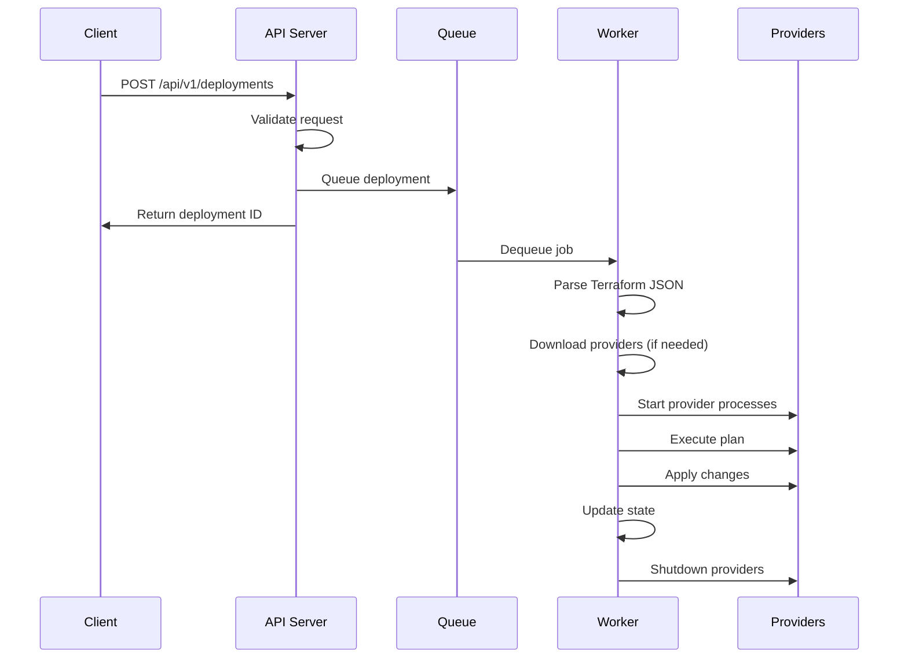

# Lattiam Architecture

## System Overview

Lattiam is an API server that executes Terraform deployments using provider plugins directly via gRPC.

```
┌─────────────┐     REST API        ┌──────────────┐
│   Clients   │ ◄───────────────-=► │  API Server  │
└─────────────┘                     └──────────────┘
                                           │
                                    ┌──────▼───────┐
                                    │    Queue     │
                                    └──────┬───────┘
                                           │
                                    ┌──────▼───────┐
                                    │   Workers    │
                                    └──────┬───────┘
                                           │
                              ┌────────────┼────────────┐
                              ▼            ▼            ▼
                        ┌──────────┐ ┌──────────┐ ┌──────────┐
                        │Provider 1│ │Provider 2│ │Provider N│
                        └──────────┘ └──────────┘ └──────────┘
                              │            │            │
                              ▼            ▼            ▼
                        ┌────────────────────────────────┐
                        │     Cloud Infrastructure       │
                        └────────────────────────────────┘
```

## Core Components

### API Server (`internal/apiserver/`)

HTTP server using chi router with these middleware:

- Request ID generation
- Real IP extraction
- Request logging
- Panic recovery
- Trailing slash stripping
- 60-second timeout
- Input validation (10MB max body)

### Queue System (`internal/queue/` and `internal/infra/`)

Two implementations:

#### Embedded (Default)

- In-memory using Go channels
- Queue capacity: 100 jobs
- Workers: 1-4 (dynamically scaled)
- Single instance only

#### Distributed (Untested)

- Redis-backed using asynq
- Unlimited capacity (Redis bound)
- Workers: 10 per instance
- Multi-instance capable

### Worker Pool (`internal/worker/`)

Processes deployments asynchronously:

1. Dequeues deployment
2. Updates status to "processing"
3. Executes via DeploymentExecutor
4. Updates final status
5. Stores results

### Deployment Executor (`internal/executor/`)

The core engine that:

1. Parses Terraform JSON
2. Resolves dependencies
3. Creates execution plan
4. Manages provider lifecycle
5. Executes resource operations
6. Handles state updates

### Provider Management (`pkg/provider/protocol/`)

Each deployment gets:

- Dedicated provider process
- Isolated working directory (`/tmp/lattiam-deployments/{deployment-id}/`)
- Clean shutdown on completion

This prevents resource conflicts when multiple deployments run concurrently.

#### Provider Binary Cache

Smart caching system:

```
~/.lattiam/providers/
├── aws/
│   ├── 5.0.0/
│   │   └── terraform-provider-aws
│   └── 5.1.0/
│       └── terraform-provider-aws
└── random/
    └── 3.6.0/
        └── terraform-provider-random
```

#### Provider Communication

- gRPC for communication
- Protocol v5 and v6 supported
- MessagePack for state serialization

### State Management (`internal/state/`)

Three backends implemented:

#### File Backend (Default)

```
~/.lattiam/state/
├── deployments/
│   ├── deploy-abc123.json
│   └── deploy-xyz789.json
└── backend.lock
```

#### Memory Backend (Testing)

- In-memory map
- Lost on restart
- Testing only

#### AWS Backend

- S3 for state files
- DynamoDB for metadata and locking
- Auto-creates bucket and table

### Event System (`internal/events/`)

Internal event bus for:

- Deployment lifecycle events
- Progress tracking
- Error propagation
- Status updates

## Request Flow

### Deployment Creation


